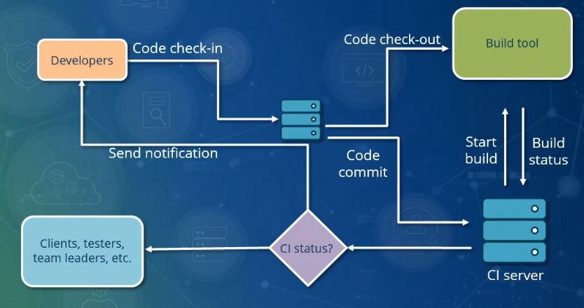

# Continuous Integration

We expect engineering teams to make an upfront investment during Sprint 0 of a project to establish an automated and repeatable pipeline which continuously integrates code and releases system executable(s) to target cloud or on-prem environments. 

Each integration should be verified by an automated build process that asserts a suite of validation tests pass and surface any errors across the developer team.

We expect teams to implement the CI/CD pipelines before any production code is written for customers, which usually happens in Sprint 0. This way, the engineering team can develop and test their work in isolation without impacting other developers and promote a consistent devops workflow throughout the engagement.

These [principles](https://martinfowler.com/articles/continuousIntegration.html) map directly agile software development lifecycle [practices](https://en.wikipedia.org/wiki/Agile_software_development).

## Goals

Continuous integration automation is an integral part of the software development lifecycle intended to reduce build integration errors and maximize velocity across a dev crew.

A robust build automation pipeline will:

- Accelerate team velocity
- Prevent integration problems
- Avoid last minute chaos during release dates
- Provide a quick feedback cycle for system-wide impact of local changes
- Separate build and deployment stages
- Measure and report metrics around build failures / success(s)
- Increase visibility across the team enabling tighter communication
- Reduce human errors, which is probably the most important part of automating the builds

## Build Definition Managed in Git

### Code / manifest artifacts required to build your project should be maintained in within your project(s) git repository(s)

- CI provider-specific build pipeline definition(s) should reside within your project(s) git repository(s).

## Build Automation

An automated build should encompass the following principles:

### Build Task

- A single step within your build pipeline that compiles your code project into a single build artifact.

### Unit Testing

- Your build definition includes validation steps to execute a suite of automated unit tests to ensure that application components meets its design and behaves as intended.

### Code Style Checks

- Code across an engineering team must be formatted to agreed coding standards. Such standards keep code consistent, and most importantly easy for the team and customer(s) to read and refactor. Code styling consistency encourages collective ownership for project scrum teams and our partners.
- There are several open source code style validation tools available to choose from ([code style checks](https://github.com/checkstyle/checkstyle), [StyleCop](https://en.wikipedia.org/wiki/StyleCop)). The [Code Review](code-reviews.md) has more details code style.
- Your code and documentation should avoid the use of non-inclusive language wherever possible. Follow the [Inclusive Linting section](inclusive-linting.md) to ensure your project promotes an inclusive work environment for both the team and for customers.
- We incorporate security analysis tools within the build stage of our pipelines such as: code credential scanner, security risk detection, static analysis, etc. 
- Code standards are maintained within a single configuration file where posible. There should be a step in your build pipeline that asserts code in the latest commit conforms to the known style definition.

### Build Script Target

- A single command should have the capability of building the system. This is also true for builds running on a CI server or on a developers local machine.

### No IDE Dependencies
  
- It's essential to have a build that's runnable through standalone scripts and not dependent on a particular IDE. Build pipeline targets can be triggered locally on their desktops through an engineers IDE of choice. The build process must maintain enough flexibility to run within a CI server as well. Dockerizing your build process is a good way to achieve this level of flexibility.

### DevOps security checks

- Introduce security to your project at early stages. Follow the [DevSecOps section](dev-sec-ops.md) to introduce security practices, automation, tools and frameworks as part of the CI.

## Build Environment Dependencies

### Automated local environment setup
  
- We encourage maintaining a consistent developer experience for all team members. There should be a central automated manifest / process that streamlines the installation and setup of any software dependencies. This way developers can replicate the same build environment locally as the one running on a CI server.
- Build automation scripts often require specific software packages and version pre-installed within the runtime environment of the OS. This presents some challenges as build processes typically version lock these dependencies.
- All developers on the team should be able to emulate the build environment from their local desktop regardless of their OS.
- Leveraging Dev Containers can really help standardize the local developer experience across the team.
- Well established software packaging tools like Docker, Maven, npm, etc should be considered when designing your build automation tool chain.

### Document local setup

- The setup process for setting up a local build environment should be well documented and easy for developers to follow. Use project repo READMEs and project documentation sites (like Confluence). Have new team members follow the documentation to keep it fresh and error free.

## Infrastructure as Code (IaC)

Manage as much of the following as possible, as code:

- Configuration Files
- Configuration Management(ie environment variable automation via terraform
- Secret Management (ie creating secrets) via terraform
- Cloud Resource Provisioning
- Role Assignments
- Load Test Scenarios
- Availability Alerting / Monitoring Rules and Conditions

Decoupling infrastructure from the application codebase simplifies engineering teams move to cloud native applications.

Terraform resource providers make it easier for developers to manage build pipeline variables, service connections and CI/CD pipeline definitions.

### Why

- Repeatable and auditable changes to infrastructure make it easier to roll back to known good configurations and to rapidly expand to new stages and regions without having to hand-wire cloud resources
- Automation enables more engineering teams deploy secure and scalable solutions at a much more rapid pace
- Simplify “lift and shift” scenarios by abstracting the complexities of cloud-native computing away from application developer teams.

### IaC DevOPS: Operations by Pull Request

- The Infrastructure deployment process built around a repo that holds the current expected state of the system / Azure environment.
- Operational changes are made to the running system by making commits on this repo.
- Git also provides a simple model for auditing deployments and rolling back to a previous state.

### Infrastructure Advocated Patterns

- You define infrastructure as code in Terraform / Ansible templates 
- Templates are repeatable cloud resource stacks with a focus on configuration sets aligned with app scaling and throughput needs. (ARM, Cloud Formation etc)

### IaC Principles

#### Automate the Cloud Environment

- All cloud resources are provisioned through a set of infrastructure as code templates. This also includes secrets, service configuration settings, role assignments and monitoring conditions.
- Cloud Web UIs should provide a read-only view on environment resources. Any change applied to the environment should be made through the IaC CI tool-chain only.
- Provisioning cloud environments should be a repeatable process that's driven off the infrastructure code artifacts checked into our git repository.

#### IaC CI Workflow
  
- When the IaC template files change through a git-based workflow, A CI build pipeline builds, validates and reconciles the target infrastructure environment's current state with the expected state. The infrastructure execution plan candidate for these fixed environments are reviewed by a cloud administrator as a gate check prior to the deployment stage of the pipeline applying the execution plan.

#### Developer Read-Only Access to Cloud Resources

- Developer accounts in a cloud web portal should have read-only access to IaC environment resources in the cloud.

#### Secret Automation

- IaC templates are deployed via a CI/CD system that has secrets automation integrated. Avoid applying changes to secrets and/or certificates directly in the cloud web UI.

#### Infrastructure Integration Test Automation

- End-to-end integration tests are run as part of your IaC CI process to inspect and validate that a cloud environment is ready for use.

#### Infrastructure Documentation

- The deployment and cloud resource template topology should be documented and well understood within the README of the IaC git repo.
- Local environment and CI workflow setup steps should be documented.

## Configuration Validation

Applications use configuration to allow different runtime behaviors and it’s quite common to use files to store these settings. As developers, we might introduce errors while editing these files which would cause issues for the application to start and/or run correctly. By applying validation techniques on both syntax and semantics of our configuration, we can detect errors before the application is deployed and execute, improving the developer (user) experience.

### Why Validate Application Configuration as a Separate Step?

- **Easier Debugging & Time saving** - With a configuration validation step in our pipeline, we can avoid running the application just to find it fails. It saves time on having to deploy & run, wait and then realize something is wrong in configuration. In addition, it also saves time on going through the logs to figure out what failed and why.
- **Better user/developer experience** - A simple reminder to the user that something in the configuration isn't in the right format can make all the difference between the joy of a successful deployment process and the intense frustration of having to guess what went wrong. For example, when there is a Boolean value expected, it can either be a string value like "True" or "False" or an integer value such as "0" or "1" . With configuration validation we make sure the meaning is correct for our application.
- **Avoid data corruption and security breaches** - Since the data arrives from an untrusted source, such as a user or an external webservice, it’s particularly important to validate the input . Otherwise, it will run at the risk of performing errors, corrupting data, or, worse, be vulnerable to a whole array of injection attacks.

## Integration Validation

An effective way to identify bugs in your build at a rapid pace is to invest early into a reliable suite of automated tests that validate the baseline functionality of the system:

### End to end integration tests

- Include tests in your pipeline to validate the build candidate conforms to automated business functionality assertions. Any bugs or broken code should be reported in the test results including the failed test and relevant stack trace. All tests should be invoked through a single command.
- Keep the build fast. Consider automated test runtime when deciding to pull in dependencies like databases, external services and mock data loading into your test harness. Slow builds often become a bottleneck for dev teams when parallel builds on a CI server are not an option. Consider adding max timeout limits for lengthy validations to fail fast and maintain high velocity across the team.

### Avoid checking in broken builds

- Automated build checks, tests, lint runs, etc should be validated locally before committing your changes to the scm repo. [Test Driven Development](https://martinfowler.com/bliki/TestDrivenDevelopment.html) is a practice engineers are expected to follow to help identify bugs and failures as early as possible within the development lifecycle.

### Reporting build failures

- If the build step happens to fail then the build pipeline run status should be reported as failed including relevant logs and stack traces.

### Test Automation Data Dependencies

- Any mocked dataset(s) used for unit and end-to-end integration tests should be checked into the mainline repository. Minimize any external data dependencies with your build process.

### Code Coverage Checks

- We expect integrating code coverage tools within your build stage. Most coverage tools fail builds when the test coverage falls below a minimum threshold(80% coverage). The coverage report should be published to your CI system to track a time series of variations.

## Git Driven Workflow

### Build on commit

- Every commit to the baseline repository should trigger the CI pipeline to create a new build candidate.
- Build artifact(s) are built, packaged, validated and deployed continuously into a non-production environment per commit. Each commit against the repository results into a CI run which checks out the sources onto the integration machine, initiates a build, and notifies the committer of the result of the build.
- Broken builds should block a pull request 

### Avoid commenting out failing tests

- Avoid commenting out tests in the mainline branch. By commenting out tests, we get an incorrect indication of the status of the build.

