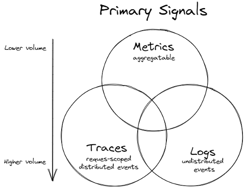

# Observability

Building observable systems enables development teams to measure how well the application is behaving. Observability serves the following goals:

- Provide holistic view of the _application health_.
- Help measure _business performance_ for the customer.
- Measure _operational performance_ of the system.
- Identify and _diagnose failures_ to get to the problem fast.

One of the design goals should be to enable monitoring of the system right from the start. Observability also acts as a great debugging tool providing developers a bird's eye view of the system. By leaving instrumentation and logging of metrics towards the end, the development teams lose valuable insights during development.

## Pillars of Observability

- [Metrics](#metrics)
- [Logs](#logs)
- [Tracing](#tracing)
- [Observability as Code](#observability-as-code)
- [Recommended Practices](#recommended-practices)

## Logs vs Metrics vs Traces

### Overview

#### Metrics

The purpose of metrics is to inform observers about the health & operations regarding a component or system. A metric represents a point in time measure of a particular source, and data-wise tends to be very small. The compact size allows for efficient collection even at scale in large systems. Metrics also lend themselves very well to pre-aggregation within the component before collection, reducing computation cost for processing & storing large numbers of metric time series in a central system. Due to how efficiently metrics are processed & stored, it lends itself very well for use in automated alerting, as metrics are an excellent source for the health data for all components in the system.

#### Logs

Log data inform observers about the discrete events that occurred within a component or a set of components. Just about every software component log information about its activities over time. This rich data tends to be much larger than metric data and can cause processing issues, especially if components are logging too verbosely. Therefore, using log data to understand the health of an extensive system tends to be avoided and depends on metrics for that data. Once metric telemetry highlights potential problem sources, filtered log data for those sources can be used to understand what occurred.

#### Traces

Where logging provides an overview to a discrete, event-triggered log, tracing encompasses a much wider, continuous view of an application. The goal of tracing is to following a program’s flow and data progression.

In many instances, tracing represents a single user’s journey through an entire app stack. Its purpose isn’t reactive, but instead focused on optimization. By tracing through a stack, developers can identify bottlenecks and focus on improving performance.

A distributed trace is defined as a collection of spans. A span is the smallest unit in a trace and represents a piece of the workflow in a distributed landscape. It can be an HTTP request, call to a database, or execution of a message from a queue.

When a problem does occur, tracing allows you to see how you got there:

* Which function.
* The function’s duration.
* Parameters passed.
* How deep into the function the user could get.

### Usage Guidance

When to use metric or log data to track a particular piece of telemetry can be summarized with the following points:

* Use metrics to track the occurrence of an event, counting of items, the time taken to perform an action or to report the current value of a resource (CPU, memory, etc.)
* Use logs to track detailed information about an event also monitored by a metric, particularly errors, warnings or other exceptional situations.
* A trace provides visibility into how a request is processed across multiple services in a microservices environment. Every trace needs to have a unique identifier associated with it.
---

## Metrics

### Overview

Metrics provide a near real-time stream of data, informing operators and stakeholders about the functions the system is performing as well as its health. Unlike logging and tracing, metric data tends to be more efficient to transmit and store.

### Collection Methods

Metric collection approaches fall into two broad categories: push metrics & pull metrics. Push metrics means that the originating component sends the data to a remote service or agent. [Azure Monitor](https://azure.microsoft.com/en-us/services/monitor) and [Etsy's statsd](https://github.com/statsd/statsd) are examples of push metrics. Some strengths with push metrics include:

- Only require network egress to the remote target.
- Originating component controls the frequency of measurement.
- Simplified configuration as the component only needs to know the destination of where to send data.

Some trade-offs with this approach:

- At scale, it is much more difficult to control data transmission rates, which can cause service throttling or dropping of values.
- Determining if every component, particularly in a dynamic scale environment, is healthy and sending data is difficult.

In the case of pull metrics, each originating component publishes an endpoint for the metric agent to connect to and gather measurements. [Prometheus](https://prometheus.io/) and its ecosystem of tools are an example of pull style metrics. Benefits experienced using a pull metrics setup may involve:

- Singular configuration for determining what is measured and the frequency of measurement for the local environment.
- Every measurement target has a meta metric related to if the collection is successful or not, which can be used as a general health check.
- Support for routing, filtering and processing of metrics before sending them onto a globally central metrics store.

Items of concern to some may include:

- Configuring & managing data sources can lead to a complex configuration. Prometheus has tooling to auto-discover and configure data sources in some environments, such as Kubernetes, but there are always exceptions to this, which lead to configuration complexity.
- Network configuration may add further complexity if firewalls and other ACLs need to be managed to allow connectivity.

### Best Practices

#### What should be tracked?

System critical measurements that relate to the application/machine health, which are usually excellent alert candidates. Work with your engineering and devops peers to identify the metrics, but they may include:

- CPU and memory utilization.
- Request rate.
- Queue length.
- Unexpected exception count.
- Dependent service metrics like response time for Redis cache, Sql server or Service bus.

Important business-related measurements, which drive reporting to stakeholders. Consult with the various stakeholders of the component, but some examples may include:

- Jobs performed.
- User Session length.
- Games played.
- Site visits.

#### Dimension Labels

Modern metric systems today usually define a single time series metric as the combination of the name of the metric and its dictionary of dimension labels. Labels are an excellent way to distinguish one instance of a metric, from another while still allowing for aggregation and other operations to be performed on the set for analysis. Some common labels used in metrics may include:

- Container Name
- Host name
- Code Version
- Kubernetes cluster name
- Azure Region

_Note_: Since dimension labels are used for aggregations and grouping operations, do not use unique strings or those with high cardinality as the value of a label. The value of the label is significantly diminished for reporting and in many cases has a negative performance hit on the metric system used to track it.

## Recommended Tools

- [Prometheus](https://docs.microsoft.com/en-us/azure/azure-monitor/overview) - A real-time monitoring & alerting application. It's exposition format for exposing time-series is the basis for OpenMetrics's standard format.
- [Thanos](https://thanos.io) - Open source, highly available Prometheus setup with long term storage capabilities.
- [Cortex](https://cortexmetrics.io) - Horizontally scalable, highly available, multi-tenant, long term Prometheus.
- [Grafana](https://grafana.com) - Open source dashboard & visualization tool. Supports Log, Metrics and Distributed tracing data sources.

---

## Logging

### Overview

Logs are discrete events with the goal of helping engineers identify problem area(s) during failures.

### Collection Methods

When it comes to log collection methods, two of the standard techniques are a direct-write, or an agent-based approach.

Directly written log events are handled in-process of the particular component, usually utilizing a provided library. This approach has some advantages:

- There is no external process to configure or monitor
- No log file management (rolling, expiring) to prevent out of disk space issues.

The potential trade-offs of this approach:

- Potentially higher memory usage if the particular library is using a memory backed buffer.
- In the event of an extended service outage, log data may get dropped or truncated due to buffer constraints.
- Multiple component process logging will manage & emit logs individually, which can be more complex to manage for the outbound load.

Agent-based log collection relies on an external process running on the host machine, with the particular component emitting log data stdout or file. Writing log data to stdout is the preferred practice when running applications within a container environment like Kubernetes. The container runtime redirects the output to files, which can then be processed by an agent. [Azure Monitor](https://azure.microsoft.com/en-us/services/monitor), [Elastic's Logstash](https://www.elastic.co/logstash) and [Fluent Bit](https://fluentbit.io/) are examples of log shipping agents.

There are several advantages when using an agent to collect & ship log files:

- Centralized configuration.
- Collecting multiple sources of data with a single process.
- Local pre-processing & filtering of log data before sending it to a central service.
- Utilizing disk space as a data buffer during a service disruption.

This approach isn't without trade-offs:

- Required exclusive CPU & memory resources for the processing of log data.
- Persistent disk space for buffering.

_Note: Agent based log shipping is used in a majority of projects and customer environments._

### Best Practices

- Pay attention to logging levels. Logging too much will increase costs and decrease application throughput.
- Ensure logging configuration can be modified without code changes. Ideally, make it changeable without application restarts.
- If available, take advantage of logging levels per category allowing granular logging configuration.
- Check for log levels before logging, thus avoiding allocations and string manipulation costs.
- Ensure service versions are included in logs to be able to identify problematic releases.
- Log a raised exception only once. In your handlers, only catch expected exceptions that you can handle gracefully (even with a specific return code). If you want to log and rethrow, leave it to the top level exception handler. Do the minimal amount of cleanup work needed then throw to maintain the original stack trace. Don’t log a warning or stack trace for expected exceptions (eg: properly expected 404, 403 HTTP statuses).
- Fine tune logging levels in production (>= warning for instance). During a new release the verbosity can be increased to facilitate bug identification.
- If using sampling, implement this at the service level rather than defining it in the logging system. This way we have control over what gets logged. An additional benefit is reduced number of roundtrips.
- Only include failures from health checks and non-business driven requests.
- Ensure a downstream system malfunction won't cause repetitive logs being stored.
- Don't reinvent the wheel, use existing tools to collect and analyze the data.
- Ensure personal identifiable information policies and restrictions are followed.
- Ensure errors and exceptions in dependent services are captured and logged. For example, if an application uses Redis cache, Service Bus or any other service, any errors/exceptions raised while accessing these services should be captured and logged.

#### Having problems identifying what to log?

**At application startup**:

- Unrecoverable errors from startup.
- Warnings if application still runnable, but not as expected (i.e. not providing blob connection string, thus resorting to local files. Another example is if there's a need to fail back to a secondary service or a known good state, because it didn’t get an answer from a primary dependency.)
- Information about the service’s state at startup (build #, configs loaded, etc.)

**Per incoming request**:

- Basic information for each incoming request: the url (scrubbed of any personally identifying data, a.k.a. PII), any user/tenant/request dimensions, response code returned, request-to-response latency, payload size, record counts, etc. (whatever you need to learn something from the aggregate data)
- Warning for any unexpected exceptions, caught only at the top controller/interceptor and logged with or alongside the request info, with stack trace. Return a 500. This code doesn’t know what happened.

**Per outgoing request**:

- Basic information for each outgoing request: the url (scrubbed of any personally identifying data, a.k.a. PII), any user/tenant/request dimensions, response code returned, request-to-response latency, payload sizes, record counts returned, etc. Report perceived availability and latency of dependencies and including slicing/clustering data that could help with later analysis.

### Recommended Tools

- [Grafana Loki](../tools/loki.md) - An open source log aggregation platform, built on the learnings from the Prometheus Community for highly efficient collection & storage of log data at scale.
- [The Elastic Stack](https://www.elastic.co/what-is/elk-stack) - An open source log analytics tech stack utilizing Logstash, Beats, Elastic search and Kibana.

---
## Tracing

### Overview

Produces the information required to observe series of correlated operations in a distributed system. Once collected they show the path, measurements and faults in an end-to-end transaction.

### Best Practices

- Ensure that at least key business transactions are traced.
- Include in each trace necessary information to identify software releases (i.e. service name, version). This is important to correlate deployments and system degradation.
- Ensure dependencies are included in trace (databases, I/O).
- If costs are a concern use sampling, avoiding throwing away errors, unexpected behavior and critical information.
- Don't reinvent the wheel, use existing tools to collect and analyze the data.
- Ensure personal identifiable information policies and restrictions are followed.

### Recommended Tools

- [Jaeger Tracing](https://www.jaegertracing.io) - Open source, end-to-end distributed tracing.

- [OpenTelemetry](../tools/OpenTelemetry.md) as it implements open-source cross-platform context propagation for end-to-end distributed transactions over heterogeneous components out-of-the-box. It takes care of automatically creating and managing the Trace Context object among a full stack of microservices implemented across different technical stacks.

---

## Observability as Code

As much as possible, configuration and management of observability assets such as cloud resource provisioning, monitoring alerts and dashboards must be managed as code. Observability as Code is achieved using any one of Terraform / Ansible / ARM Templates

### Examples of Observability as Code

1. Dashboards as Code - Monitoring Dashboards can be created as JSON or XML templates. This template is source control maintained and any changes to the dashboards can be reviewed. Automation can be built for enabling the dashboard. 
_ex: Grafana dashboard can also be [configured as code](https://grafana.com/blog/2020/02/26/how-to-configure-grafana-as-code/) which eventually can be source-controlled to be used in automation and pipelines._

2. Alerts as Code - Alerts can be created within Azure by using Terraform or ARM templates. Such alerts can be source-controlled and be deployed as part of pipelines (Azure DevOps, Jenkins, GitHub Actions etc.). 
_ex: Few references of how to do this are: [Terraform Monitor Metric Alert](https://registry.terraform.io/providers/hashicorp/azurerm/latest/docs/resources/monitor_metric_alert)._
_ex: Alerts can also be created based on log analytics query and can be defined as code using [Terraform Monitor Scheduled Query Rules Alert](https://registry.terraform.io/providers/hashicorp/azurerm/latest/docs/resources/monitor_scheduled_query_rules_alert#example-usage)._

3. Automating Log Queries - There are several use cases where automation of log queries may be needed. Example, Automatic Report Generation, Running custom queries programmatically for analysis, debugging etc. For these use cases to work, log queries should be source-controlled and automation can be built.

### Why

- It makes configuration repeatable and automatable. It also avoids manual configuration of monitoring alerts and dashboards from scratch across environments.

- Configured dashboards help troubleshoot errors during integration and deployment (CI/CD)

- We can audit changes and roll them back if there are any issues.

- Identify actionable insights from the generated metrics data across all environments, not just production.

- Configuration and management of observability assets like alert threshold, duration, configuration
values using IAC help us in avoiding configuration mistakes, errors or overlooks during deployment.

- When practicing observability as code, the changes can be reviewed by the team similar to other code
contributions.
---

## Recommended Practices

1. **Correlation Id**: Include unique identifier at the start of the interaction to tie down aggregated data from various system components and provide a holistic view. 

1. Ensure health of the services are **monitored** and provide insights into system's performance and behavior.

1. Ensure **dependent services** are monitored properly. Errors and exceptions in dependent services like a Redis cache, Service bus, or event a 3rd party service like a payment gateway etc. should be logged and alerted. Also, metrics related to dependent services should be captured and logged.

    - Additionally, failures in **dependent services** should be propagated up each level of the stack by the health check.

1. **Faults, crashes, and failures** are logged as discrete events. This helps engineers identify problem area(s) during failures.

1. Ensure logging configuration (eg: setting logging to "verbose") can be controlled without code changes.

1. Ensure that **metrics** around latency and duration are collected and can be aggregated.

1. Start small and add where there is customer impact is very crucial to collecting actionable data.

1. It is important that every data that is collected contains relevant and rich context.

1. Personally Identifiable Information or any other customer sensitive information should never be logged. Special attention should be paid to any local privacy data regulations and collected data must adhere to those. (ex: GDPR)

1. **Health checks** : Appropriate health checks should added to determine if service is healthy and ready to serve traffic. On a kubernetes platform different types of probes e.g. Liveness, Readiness, Startup etc. can be used to determine health and readiness of the deployed service.

###  Fatigue

1. It is recommended to collect and measure *what you need* **and** *not what you can*. Don't attempt to monitor everything.
2. If the data is not actionable, it is useless and becomes noise. On the contrary, it is sometimes very difficult to forecast every possible scenario that could go wrong.
3. There must be a balance between collecting what is needed vs. logging every single activity in the system. A general rule of thumb is to follow these principles

   - rules that catch incidents must be simple, relevant and reliable
   - any data that is collected but not aggregated or alerted on must be reviewed if it is still required.